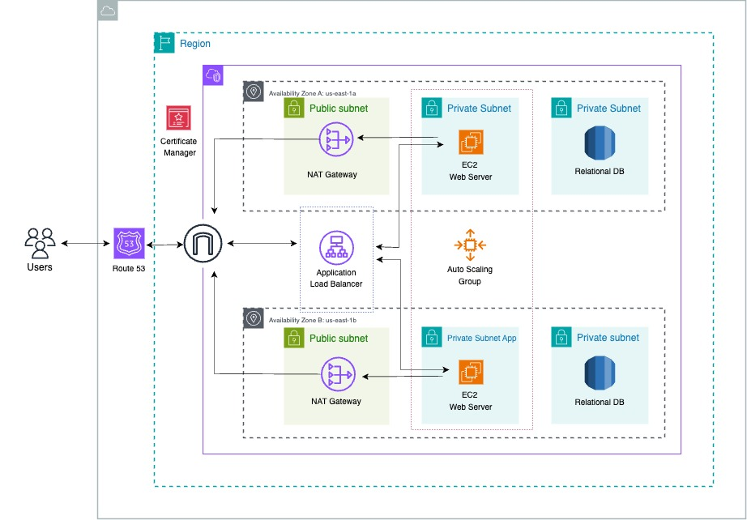

# Project Overview
This hands-on demonstrates the deployment of a static HTML web application on the AWS console using various services and resources. The setup includes a Custom VPC with public and private subnets spread across multiple availability zones for high availability and fault tolerance. It utilizes an Application Load Balancer to distribute web traffic across EC2 instances hosted in the public subnets, providing scalability and elasticity through an Auto Scaling Group. Security is enforced using Security Groups and a Bastion Host, while the NAT Gateway facilitates internet access for instances in private subnets


---

# Project Resources
**Custom VPC** with public and private subnets in 2 availability zones.
**Internet Gateway** for communication between VPC instances and the internet.
**Security Groups** for firewall configuration.
**2 Availability Zones** for high availability and fault tolerance.
**NAT Gateway** for private subnet internet access.
**Bastion Host** for secure access to private resources.
**EC2 Instance Connect Endpoint** for resource connectivity.
**EC2 Instances** hosting the static website.
**Application Load Balancer** to distribute web traffic.
**Auto Scaling Group** for dynamic EC2 instance management.
**Route 53** for domain registration and DNS management.
**Certificate Manager** Provides SSL/TLS for secure connections.

# Deployment Script For The Project
Below is the bash script used to deploy the web app on an EC2 instance:

```bash
#!/bin/bash
sudo su

# Update all installed packages
yum update -y

# Install Apache HTTP Server
yum install -y httpd

# Install Git
yum install -y git

# Change to Apache web root
cd /var/www/html

# Download the project zip file
wget https://github.com/bojide/jupiter-site/raw/main/jupiter.zip

# Unzip into the Apache web root
unzip jupiter.zip

# Copy website files to Apache root
cp -r /var/www/html/jupiter-site/* /var/www/html

# Clean up repository folder
rm -rf jupiter.zip jupiter-main

# Enable Apache to start on boot and start it immediately
systemctl enable httpd
systemctl start httpd
```

# Deployment Steps
1. **Setting Up Infrastructure**
- Create a Custom VPC (Virtual Private Cloud) with public and private subnets across 2 availability zones.
- Attach an Internet Gateway to the VPC to enable connectivity between resources in the VPC and the internet.
- Configure Security Groups to control inbound and outbound traffic.
- Deploy NAT Gateway for private subnet internet access.
- Implement a Bastion Host for secure access to private resources.

2. **EC2 Instance Configuration**
- Launch EC2 Instances in the public subnets to host the website.
- Configure EC2 Instance Connect Endpoint for connectivity.
- Install Apache HTTP Server (httpd) on EC2 instances.

3. **Load Balancing and Auto Scaling**
- Set up an Application Load Balancer to distribute web traffic across EC2 instances.
- Create an Auto Scaling Group to ensure high availability, scalability, fault tolerance, and elasticity of the website.

4. **Domain Registration and DNS Configuration**
- Register a domain name using Route 53.
- Configure DNS settings to point to the Application Load Balancer.

5. **Certificate Manager**
- Provisions, manages, and deploys SSL/TLS certificates to secure application communications over HTTPS.

6. **SNS**
- Pub/sub messaging service used to send alerts and notifications (e.g., Auto Scaling activities, CloudWatch alarms).

7. # The Final Outcome of the Project with my Custom Domain Name
- Viewed on Google Chrome.
  

  - Viewed on Safari.
  
